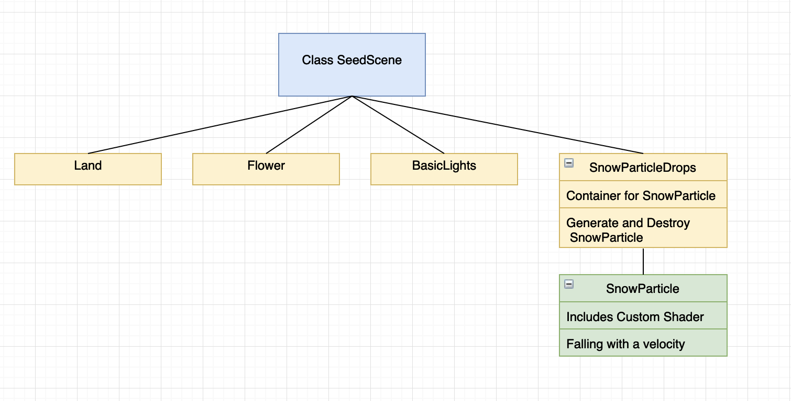
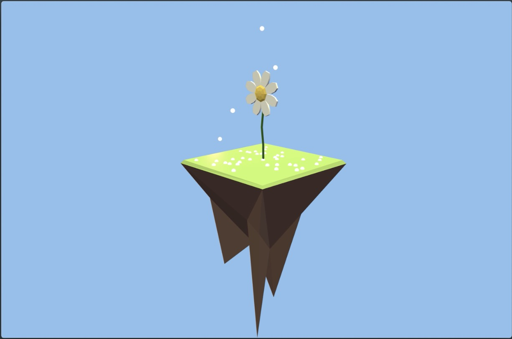
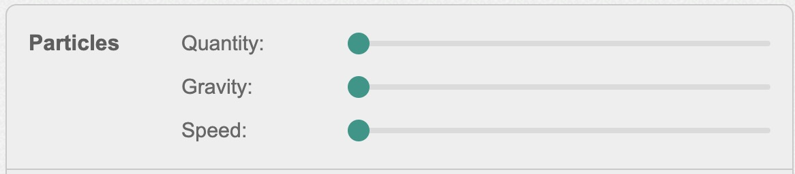

# WebGL based 3D Snow Simulation 

# Milestone Report Webpage

Fan Zhang, Yu Chieh Lan and Zhaoxiong Cui

University of California, Berkeley

## Links

Since we are CS284A students, so our milestone will be introduced in the report. Here is the link for our report, video and slides.

ACM format report: [Report](./CS284_Milestone_report.pdf)

Video: [Video](<https://www.youtube.com/watch?v=Zna6Vt-kGm8&feature=youtu.be>)

Slides: [Slides](<https://docs.google.com/presentation/d/1mAv_F3VsbKHxLsbL8GtwQDKWf1MPO0i5qfAc31wAGJA/edit#slide=id.g590a8959cd_0_12>)

For detailed explaination of what we have done, please see our report. This website is just a brief introduction of our work.

## Current Progress

#### 1. WebGL Framework

We developed the WebGL framework based on Three.js [4] which is a cross-browser JavaScript library and Application Programming Interface (API) used to create and display animated 3D computer graphics in a web browser, this is the code structure of our project.

#### 2. Data Structure

To facilitate the three-parts work flow, we designed several key data structures as a bridge between the physical modeling (simulation) and the rendering pipeline. (Details in report)

#### 3. Shader

We just tested how to use the customized shader in WebGL based on Three.js and now we have implemented a simple customized shader and we are still developing it.

#### 4.User Interface

Since it is a web based application so we want to add some interactions for users to interact with our simulation including changing the size of particles, changing the number of particles. Based on Javascript and HTML, we also designed a user interface for our WebGL application. We just designed a simple interaction interface right now and we will add more features as we finish the physical properties this week so we can know how many hyperparameters we can change to view the difference among rendering results. Figure 3 shows one basic UI element to change the size of the particle and the number of particles in the scene.

