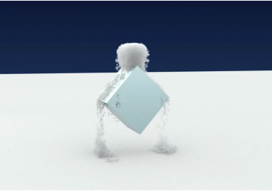

# 3D Snow Simulation based on WebGL

Fan Zhang, Yu Chieh Lan and Zhaoxiong Cui

University of California, Berkeley

## Introduction

Snow is a common natural phenomenon in the real world which covers the ground all the white in the winter. However, in computer graphics, it is a challenging task to model the snow digitally. Different from other weather phenomena, snow has both the solid-like and fluid-like properties which are difficult to handle. In the meantime, the dynamic scenes of snow can be divided into three parts, namely, snow falling, snow accumulation, snow wind interaction. Since snow is composed of small ice particles, it is a granular material, so we can representation is with the particle system. There have been some works in snow simulations based on particles system[1], finite-element discretization[2], material point method[3]. Among those works, the material point method(MPM) is the most famous one which was the first method to handle the richness of dense and wet snow.

Efficiency is always a challenging part for graphics simulations since we need to perform ray-tracing, material modeling, rasterization when need a lot of computational resources. Currently, most of the computer graphics works are implemented in C++ with OpenGL[4] since it supports GPU. However, to render a demo in OpenGL, we need to download the source code, compile it and then render it, which is complicated. Inspired by a really cool WebGL demo of water simulation (Figure 1), we want to implement the snow simulation based on WebGL.

Figure 1: WebGL Water Simulation: https://experiments.withgoogle.com/webgl-water-simulation

## Problem description

Visually simulate snow is a challenging problem. What we need is not only to render a unique texture of snow, but also to recover the behavior of snow particles. Luckily, researchers have figured out the way to model the snow as a particle system. [3] proposed a physical model of snow which can be used to simulate a realistic snow effects.

Based on this research, several groups of people made implementations. Such as [Azmisov/snow](<https://github.com/Azmisov/snow>) and [JAGJ10/Snow](https://github.com/JAGJ10/Snow). These implementations are mostly based on C++, or some desktop graphics framework like [Houdini](https://www.sidefx.com/products/houdini/). 

Although these implementations are fast and awesome, the dependency of C++ or other heavy stuffs limit their usage, and more importantly, make them less accessable. To take a look of these fantastic snow effects, one has to first fetch down the code, solve the dependency issues, then compile. It's really hard for a non-CS-major person to do all these tricks. Even though you may somehow compile and pack all the stuff up, you will still need a desktop PC to run the program.

Ideally, we want to only require the viewer type in a web address, or scan a QR code, then a fantastic snow effect will show in the browser. Such an experience is already available for a lot of in-browser visual website, like [The Spirit](http://edankwan.com/experiments/the-spirit/). Indeed, what we really need is an interactive, easy-to-access website, while still keeping an original and awesome experience of snow. 

Figure 2: in-browser interactive visual effect of [The Spirit](http://edankwan.com/experiments/the-spirit/).

## Goals and Deliverables

Our goal is to construct snowy scenes and accomplish the animation simulation in real-time. The scenes could include different shapes of snow on different terrains. For example, we could render a scene which shows a snowball rolling down from a slope as shown in Figure 3; we can also simulate a box of snow dropping from the sky, and on the way it falls, it is blocked by some objects (Figure 4). In addition to the snow-particle simulation, we will add shaders to the objects to accomplish a decent rendering in real-time. We will evaluate our implementation by measuring the frame rate,  CPU, GPU, and memory usage. The comparison could be done under different settings- the tunable variables include the number of particles, hardening coefficient, the shader settings, etc. 

Because it is a web page, we should also include a user interface that enables users to design and interact with the scene. The interface may provide some tools with which users can construct different shapes of snow and place them on a different location. Tuning bars could also be provided on the interface to adjust some parameters within reasonable ranges. Real-time interaction may be an interesting function, users can catch the falling snow by dragging different containers.

Figure 3: Rolling Snowball Scene from [3]

Figure 4: Falling snow blocked by a cube from [5]

## Resources

[1] Tan, Jian, and Xiangtao Fan. "Particle system based snow simulating in real time." *Procedia Environmental Sciences* 10 (2011): 1244-1249.

[2] Dutykh, Denys, Céline Acary‐Robert, and Didier Bresch. "Mathematical Modeling of Powder‐Snow Avalanche Flows." *Studies in Applied Mathematics* 127, no. 1 (2011): 38-66.

[3]Stomakhin, Alexey, Craig Schroeder, Lawrence Chai, Joseph Teran, and Andrew Selle. "A material point method for snow simulation." *ACM Transactions on Graphics (TOG)* 32, no. 4 (2013): 102.

[4] OpenGL:<https://opengl.org/>

[5] https://dreamingincodezh.github.io/SnowSimulator/final/report.pdf